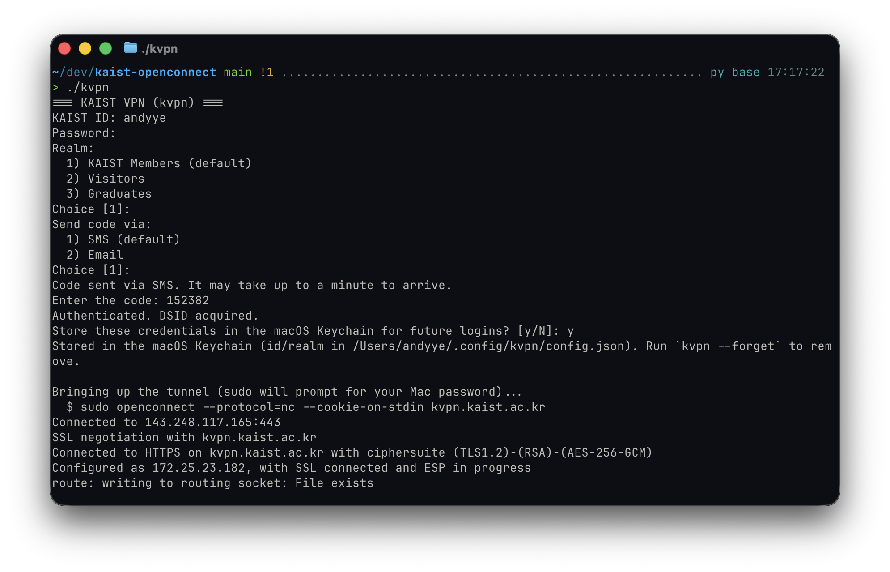

# kaist-openconnect

**한국어** | [English](README.en.md)

브라우저 없이 터미널에서 바로 **KAIST VPN**(Ivanti Connect Secure + AirCUVE
"2Auth" 2단계 인증)에 접속하는, 의존성 없는 작은 명령줄 클라이언트입니다.

ID, 비밀번호, 일회용 코드(SMS 또는 이메일)를 입력받아 2단계 인증을 완료한 뒤
[OpenConnect](https://www.infradead.org/openconnect/)로 터널을 엽니다.

## 설치 (Windows, Linux, macOS)

### Linux / macOS

터미널에 아래 한 줄을 붙여넣으면 끝입니다 — Homebrew(macOS, 없을 때만)와
OpenConnect까지 필요한 것을 전부 설치하고, `kvpn`을 `PATH`에 연결합니다:

```sh
/bin/bash -c "$(curl -fsSL https://raw.githubusercontent.com/seo-rii/kaist-openconnect/main/install.sh)"
```

설치가 끝나면 `kvpn`으로 실행하세요. 이미 설치된 것은 건너뛰므로 다시 실행해도
안전하며, 다시 실행하면 kvpn이 최신 버전으로 갱신됩니다. Linux에서는 배포판
패키지 관리자(apt/dnf/pacman/zypper/apk)로 의존성을 설치합니다.

### Windows

먼저 [Python 3](https://www.python.org/downloads/windows/)를 설치하세요. 공식
[OpenConnect 9.21 Windows 빌드 ZIP](https://gitlab.com/openconnect/openconnect/-/jobs/artifacts/v9.21/download?job=MinGW64%2FGnuTLS)을
내려받아 압축을 풀고 `openconnect-installer-MinGW64-GnuTLS-v9.21.exe`를 실행하면
OpenConnect와 Wintun 드라이버가 설치됩니다. 그 다음 일반 PowerShell에서 아래
명령으로 `kvpn`을 사용자 `PATH`에 설치합니다:

```powershell
irm https://raw.githubusercontent.com/seo-rii/kaist-openconnect/main/install.ps1 | iex
```

VPN 연결은 터널 장치를 만들 권한이 필요하므로 **관리자 권한 PowerShell 또는 명령
프롬프트**를 열어 `kvpn`을 실행하세요. OpenConnect를 기본 위치가 아닌 곳에
설치했다면 실행 전에 `KVPN_OPENCONNECT` 환경 변수에 `openconnect.exe`의 전체
경로를 지정하면 됩니다.

<details>
<summary>수동 설치 (설치 스크립트를 쓰고 싶지 않다면)</summary>

[요구 사항](#요구-사항)을 직접 설치한 뒤:

```sh
git clone https://github.com/seo-rii/kaist-openconnect.git
cd kaist-openconnect
chmod +x kvpn
./kvpn
```

Windows에서는 같은 체크아웃에서 `./install.ps1`을 실행한 뒤 관리자 터미널에서
`kvpn`을 실행하세요.

원한다면 `PATH`에 추가하세요:

```sh
ln -s "$PWD/kvpn" /usr/local/bin/kvpn
```

</details>

기본 ID를 설정해 두면 프롬프트에서 Enter만 누르면 됩니다:

```sh
export KVPN_USER=your_id   # ~/.zshrc 또는 ~/.bashrc 에 추가
```



자격 증명을 저장해 두면 이후 실행에서는 곧바로 코드 입력 단계로 넘어갑니다:

```
$ ./kvpn
=== KAIST VPN (kvpn) ===
Using stored credentials for your_id (KAIST Members). Run `kvpn --forget` to remove.
Send code via:
  1) SMS (default)
  2) Email
Choice [1]:
```

## 왜 만들었나

KAIST VPN은 Ivanti Connect Secure에 AirCUVE 2차 인증을 얹은 구조인데, OTP 단계가
별도 호스트의 JavaScript 포털 안에서 동작합니다. OpenConnect 단독으로는 이 포털을
처리할 수 없어서, 흔한 해법은 "브라우저로 로그인해서 `DSID` 쿠키를 복사한 다음
openconnect를 실행하라"는 것이었습니다. 이 도구는 그 과정 전체를 자동화합니다:
포털의 OTP 흐름을 순수 HTTP로 수행하고, 얻은 세션 쿠키를 OpenConnect에
넘겨줍니다.

**아무것도 우회하지 않습니다.** 공식 클라이언트와 똑같이, 매 접속마다 본인의
비밀번호와 새 일회용 코드로 인증합니다.

## 요구 사항

- **Python 3** (표준 라이브러리만 사용 — `pip install` 불필요)
- **[OpenConnect](https://www.infradead.org/openconnect/)** — `PATH`에 있어야
  합니다 (macOS에서는 `brew install openconnect`)
- 관리자 권한 (`sudo` 또는 Windows 관리자 터미널; OpenConnect가 터널
  인터페이스를 만들 때 필요합니다)

Linux에서는 OpenConnect 패키지의 기본 `vpnc-script`를, Windows에서는 공식
설치기에 포함된 Wintun과 `vpnc-script-win.js`를 사용합니다.

## 사용법

`./kvpn`을 실행하고 프롬프트를 따라가면 됩니다. 연결을 끊으려면 실행 중인
터미널에서 **Ctrl-C** 를 누르세요 — OpenConnect가 터널을 정리하고 라우팅을
복원합니다.

### 자격 증명 저장

로그인에 성공하면 kvpn이 자격 증명 저장을 제안하며, 저장해 두면 이후 실행은
곧바로 "Send code via" 단계로 넘어갑니다. 비밀번호는 macOS에서는 **키체인**에,
Windows에서는 **Windows 자격 증명 관리자**에 저장됩니다. ID와 realm은 macOS와
Linux의 `~/.config/kvpn/config.json`, Windows의
`%APPDATA%\kvpn\config.json`에 저장됩니다. 보안 저장소가 없는 Linux에서는
비밀번호도 사용자 전용(`0600`) 설정 파일에 저장되며 저장 전에 경고합니다. 어느
경우든 일회용 코드는 매 접속마다 새로 필요합니다.

저장된 내용을 모두 삭제하려면:

```sh
./kvpn --forget
```

`KVPN_DEBUG=1`을 설정하면 초기화·발송·검증 단계의 HTTP 진단 정보를 stderr로
출력합니다. 상태 코드, 응답 형식과 길이, JSON 구조, 알려진 오류 페이지 징후를
포함합니다:

```sh
KVPN_DEBUG=1 ./kvpn
```

Windows PowerShell에서는 `KVPN_DEBUG_LOG`에 파일 경로를 지정하면 입력 프롬프트를
유지하면서 진단 정보만 파일에 저장할 수 있습니다. 파일 경로만 설정해도 기록이
활성화됩니다:

```powershell
$env:KVPN_DEBUG_LOG = Join-Path $env:TEMP ("kvpn-debug-{0}.log" -f (Get-Date -Format "yyyyMMdd-HHmmss"))
kvpn
Get-Content -LiteralPath $env:KVPN_DEBUG_LOG
```

재현이 끝나면 위 명령으로 읽은 `[kvpn-debug]` 줄을 공유하면 됩니다. 요청 본문,
쿠키, 응답 본문의 문자열값과 숫자값, URL의 쿼리와 인증 토큰은 기록하지 않습니다.
원본 HTTP 본문이나 터미널 전체 기록을 공유할 필요가 없습니다. 진단 기록을 끄려면
`Remove-Item Env:\KVPN_DEBUG_LOG`를 실행하세요. 파일은 UTF-8로 이어쓰기하며
Linux/macOS에서는 사용자 전용(`0600`) 권한으로 저장합니다.

## 동작 원리

로그인은 두 호스트 — Ivanti 게이트웨이(`kvpn.kaist.ac.kr`)와 AirCUVE
포털(`kvpnportal.kaist.ac.kr:8443`) — 를 오가는 체인입니다:

1. `GET kvpn.kaist.ac.kr/` — Ivanti 로그인 세션을 얻습니다.
2. `GET portal /view/redirectVPN` — 포털 세션과 correlation code를 발급받습니다.
3. `POST login.cgi` — ID, 비밀번호, realm과 전체 handshake 값을 `password#2`로
   제출해 1차 인증을 진행합니다. 이 시점에는 아직 `DSID`를 요구하지 않습니다.
4. `GET portal /view/onepassCheck` → `/vpnInit` — handshake에서 접두사를 뺀
   correlation code로 1차 인증 결과를 확인하고 OTP 컨텍스트를 설정합니다.
5. `GET portal /oauth/authorize` — OAuth 요청을 Spring Security의 "saved
   request"로 등록해, OTP 이후 리다이렉트가 OAuth 흐름으로 돌아오게 합니다.
   `/request`의 JavaScript가 만드는 `POST /view/redirect`도 수행하고 OTP 메뉴에
   도달했는지 확인합니다. 잘못된 접근·세션 만료 페이지에서는 발송하지 않습니다.
6. `POST portal /api/portal` (`cmd=AuthPortal.twoAuthSend`) — SMS/이메일 코드를
   발송합니다.
7. `POST portal /j_spring_security_check.do` — 코드를 검증하면 Spring이
   `/oauth/authorize` → `/vpn/<client_id>?code=…` 로 리다이렉트합니다.
8. 그 페이지가 노출하는 `message` 토큰이 Ivanti의 `password#2`가 됩니다.
9. `POST login.cgi` — username, password, realm, `password#2`를 보내면 `DSID`
   세션 쿠키를 받습니다.
10. `sudo openconnect --protocol=nc --cookie-on-stdin kvpn.kaist.ac.kr` — DSID를
    stdin으로 전달해 프로세스 목록에 노출되지 않게 합니다.

## 참고 및 문제 해결

- **이메일/SMS 코드가 오지 않는다면:** kvpn은 포털이 `success: "true"`로
  요청을 수락한 경우에만 코드 입력을 요청합니다. `emailNull` 또는
  `phoneNumberNull`은 포털에 해당 연락처가 등록되지 않았다는 뜻입니다.
  [공식 VPN 포털](https://kvpn.kaist.ac.kr/)에서 같은 계정으로 확인하세요.
  `Portal accepted`는 요청 접수가 확인됐다는 뜻이며 실제 메일함 도착을
  보장하지는 않습니다. 발송 실패 시 표시되는 `Error:` 문구를 확인하세요.
- **로그에 `onepassCheck`의 `invalid-access`가 보인다면:** 코드 발송 이전의
  초기 인증이 실패한 것입니다. 설치 명령을 다시 실행해 갱신하세요. 새 버전의
  로그는 `diagnostics_version: 2`이며, `onepassCheck` 전에 `POST login.cgi`가
  나타나고 OTP 메뉴 확인 후 `portal-init`의 `phase: "otp-ready"`가 기록됩니다.
  계속 실패하면 새 로그와 `Error:` 문구를 함께 확인하세요.
- **검증 범위:** CI는 모의 포털 응답을 이용해 초기 인증 순서·실패 중단,
  발송 성공·거절 처리와 이메일(`otp_flag=2`)/SMS(`otp_flag=1`) 검증 요청을 검사합니다.
  실제 KAIST 계정의 메일 수신과 VPN 연결은 CI에서 시험하지 않습니다.
- **자격 증명 저장은 선택(opt-in)입니다.** 저장 프롬프트에서 "y"라고 답하지 않는
  한 아무것도 저장되지 않으며, `kvpn --forget`으로 전부 삭제할 수 있습니다.
  `DSID`는 어차피 일시적이고(연결이 끊기면 소멸), 일회용 코드는 매 접속마다 새로
  필요합니다.
- **저장된 비밀번호가 낡았다면?** KAIST 비밀번호를 바꾸면 초기 인증 또는 마지막
  로그인 단계가 실패합니다 — `kvpn --forget` 후 다시 로그인하세요.
- **Linux/macOS의 `sudo` 프롬프트 충돌:** stdin이 파이프로 연결된 탓에 `sudo`가 오작동하면
  `sudo -v`를 먼저 실행한 뒤 `./kvpn`을 실행하세요.
- **Windows에서 OpenConnect를 찾지 못한다면:** `KVPN_OPENCONNECT`를
  `openconnect.exe`의 전체 경로로 설정하세요. 기본 공식 설치 위치인
  `C:\Program Files\OpenConnect`는 자동으로 찾습니다.
- **무해한 라우트 경고:** 접속 시 자기 VPN IP로의 라우트나 이미 존재하는 라우트에
  대해 `Can't assign requested address` / `File exists` 같은 줄이 보일 수
  있습니다. 나머지 라우트는 모두 정상적으로 설치되며 연결에는 영향이 없습니다.
- **로그인이 갑자기 깨졌다면** KAIST가 포털 흐름을 바꿨을 가능성이 큽니다.
  `KVPN_DEBUG=1`로 실행해 (민감한 정보를 가린) hop 목록과 함께 이슈를 올려주세요.

## 면책 조항

이 도구는 비공식 개인 상호운용성(interoperability) 도구이며, **KAIST, Ivanti,
AirCUVE와 무관하고 이들의 승인을 받지 않았습니다**. 본인 계정으로, 소속 기관의
이용 정책에 맞게 사용하세요. 어떤 종류의 보증도 없이 "있는 그대로" 제공됩니다
([LICENSE](LICENSE) 참조).

## 감사의 말

실제 VPN 터널링을 담당하는 훌륭한
[OpenConnect](https://www.infradead.org/openconnect/) 프로젝트 위에
만들어졌습니다.
